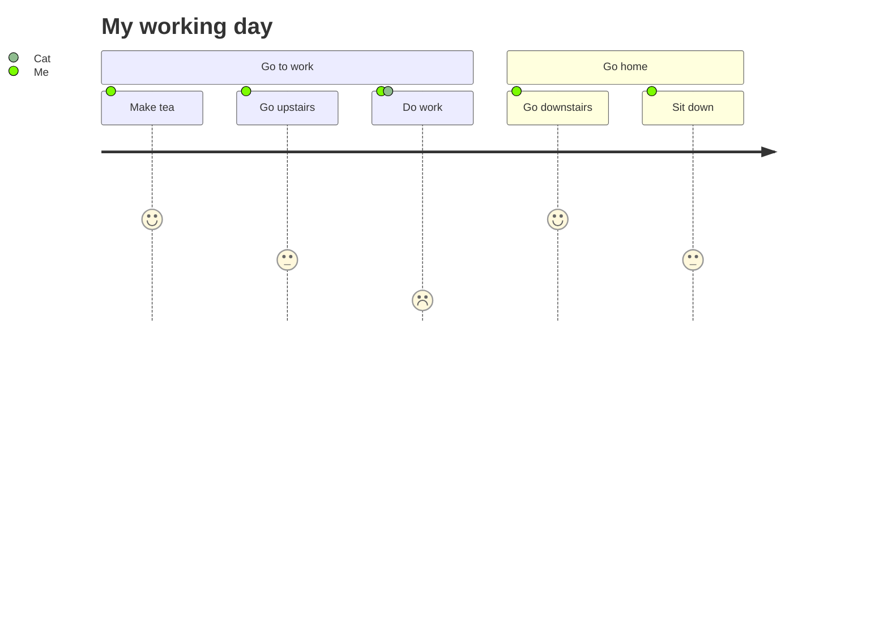

### Getting Started

Canonical is a powerful document editor designed for product teams who are building complex products.&#x20;

### Editor Features

Canonical's editor uses [markdown standards](https://www.markdownguide.org/basic-syntax/) to help you develop native tech friendly documents.&#x20;

Some of the extras you get beyond typical markdown editors:

* 👍 **Emoji Support**
* 🎥 **Embed Gifs**
* 📊 **Advanced** **Markdown Tables**
* 🖥 **Code Syntax Highlighting**

Additionally. Canonical offers some unique features:&#x20;

##### Referencing Other Product Documents

Document referencing is a core concept in canon. You shouldn't have to duplicate content in multiple places. That frequently leads to un-synced information, which can dilude what the true meaning and objective of your artifacts are. In code we put things in functions(), in documents with reference with something akin to a function.&#x20;

To reference an existing document, or create a new document type `@`

To insert a link to an existing document, choose from the select. Existing docs look like this: [@How To] and show up in-line in your text

To create a link to a document that doesnt exist yet simply type in the input and hit enter [@I'm a new doc!] when you click on the link. your doc will be automatically generated based on the content. This is useful to leave placeholders in your documentation for ideas you want to flesh out later

##### Generating Text

Ideation can be tough. Sometimes its difficult to know where to start with a framework, template or finding the right words. Canonical makes it easy to get started. Type `/gen` To pull up the content generation menu. you can pre-select from some existing prompts or type your own. Some helpful tips

* Be specific, think of this as your product sidekick, they might know all about your product but dont know whats inside your head
* Avoid Jargon, use simple words to describe what you're trying to do.&#x20;

##### Keep track of your todos 

Products have a LOT going on, and every day can be different. bouncing between design, architecture, stakeholder requirements, communication. Its great practices to keep track of stuff you need to do later with a TODO. Add `//todo` to any document. We'll keep track of all your todo's in one place . that you can take a look at and organize later

##### Diagrams

Canonical implements [mermaid](https://mermaid.js.org/) diagrams. With this you can make beautiful charts that capture complext behaviors and relationships in your produt. Type  ` ```mermaid  `               to create a blank document. or type `/gen `                  and ask for a mermaid diagram of your content.

Here is an example:&#x20;


